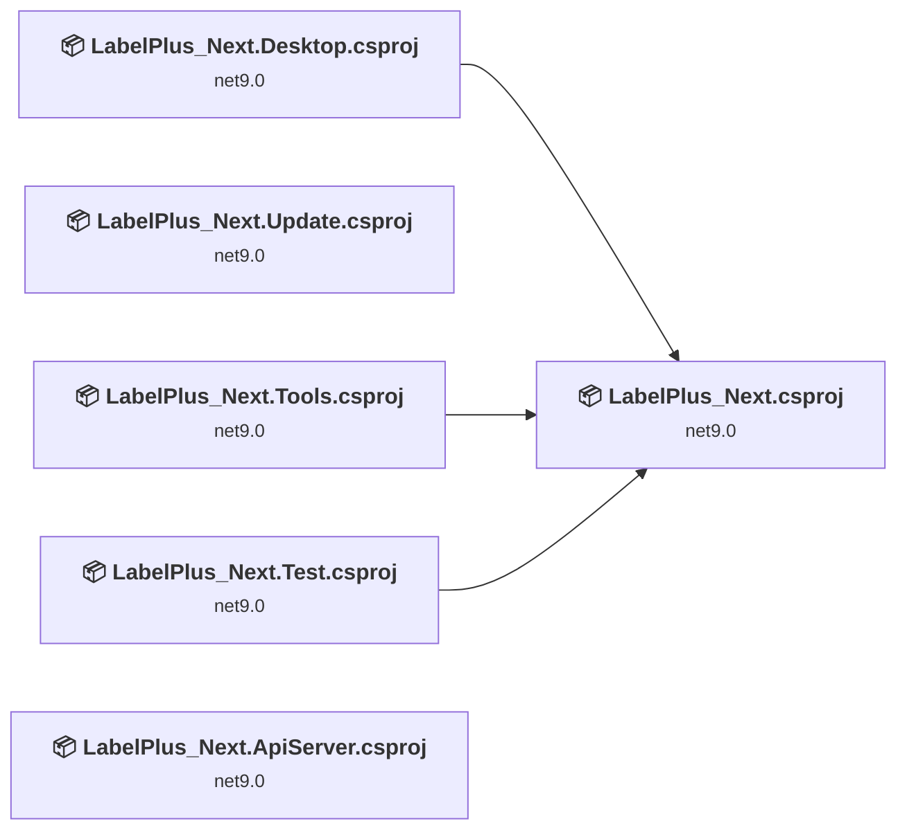
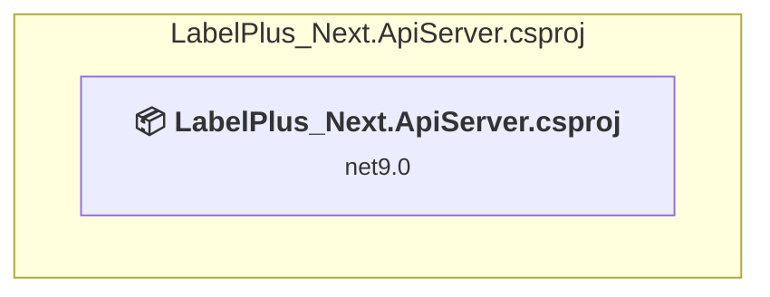
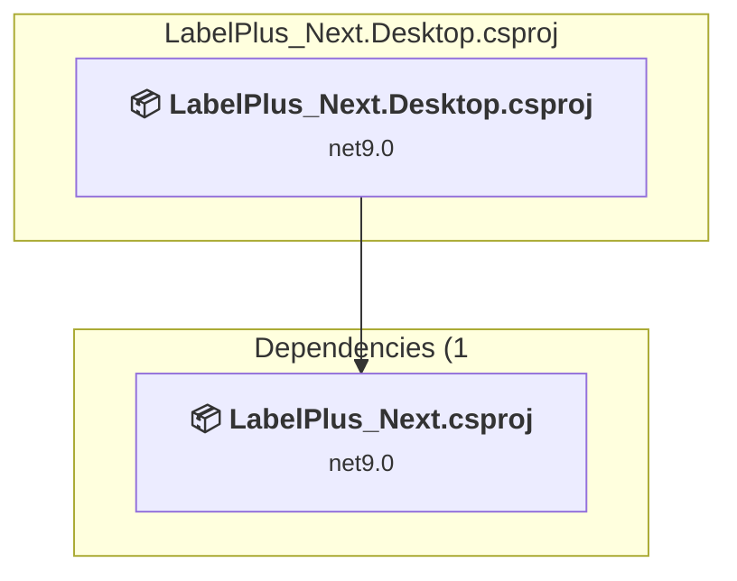
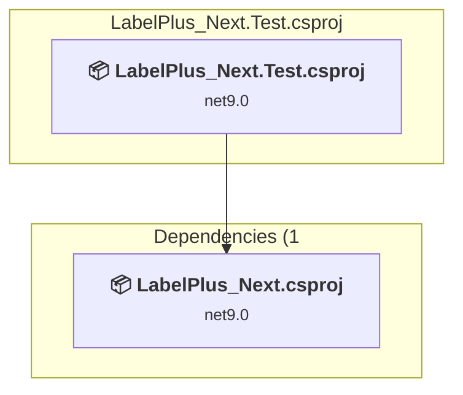
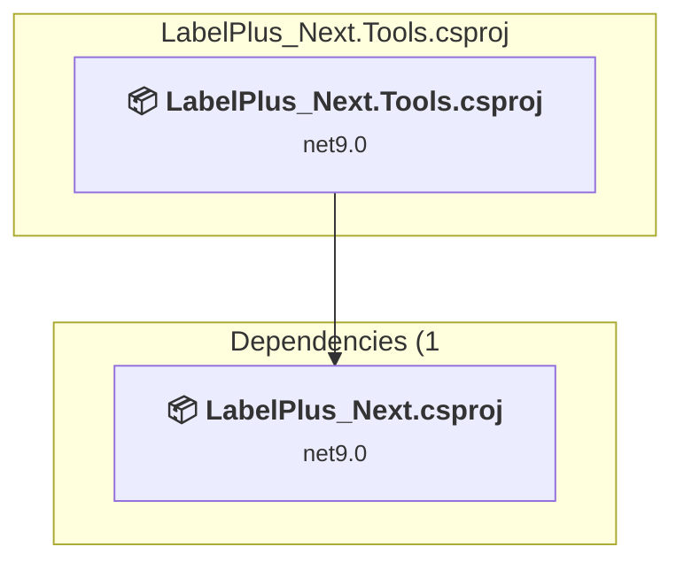
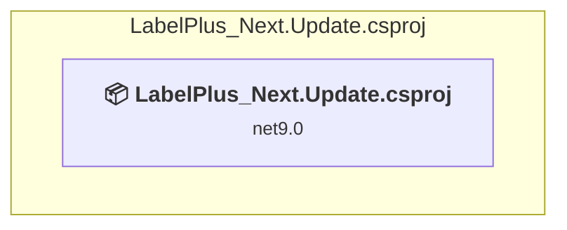
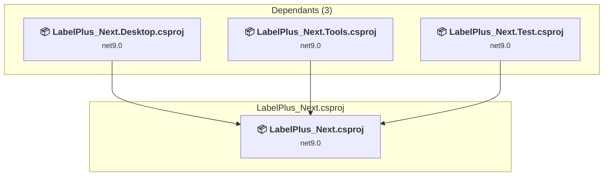

# Projects and dependencies analysis

This document provides a comprehensive overview of the projects and their dependencies in the context of upgrading to .NETCoreApp,Version=v10.0.

## Table of Contents

- [Executive Summary](#executive-Summary)
  - [Highlevel Metrics](#highlevel-metrics)
  - [Projects Compatibility](#projects-compatibility)
  - [Package Compatibility](#package-compatibility)
  - [API Compatibility](#api-compatibility)
- [Aggregate NuGet packages details](#aggregate-nuget-packages-details)
- [Top API Migration Challenges](#top-api-migration-challenges)
  - [Technologies and Features](#technologies-and-features)
  - [Most Frequent API Issues](#most-frequent-api-issues)
- [Projects Relationship Graph](#projects-relationship-graph)
- [Project Details](#project-details)

  - [LabelPlus_Next.ApiServer\LabelPlus_Next.ApiServer.csproj](#labelplus_nextapiserverlabelplus_nextapiservercsproj)
  - [LabelPlus_Next.Desktop\LabelPlus_Next.Desktop.csproj](#labelplus_nextdesktoplabelplus_nextdesktopcsproj)
  - [LabelPlus_Next.Test\LabelPlus_Next.Test.csproj](#labelplus_nexttestlabelplus_nexttestcsproj)
  - [LabelPlus_Next.Tools\LabelPlus_Next.Tools.csproj](#labelplus_nexttoolslabelplus_nexttoolscsproj)
  - [LabelPlus_Next.Update\LabelPlus_Next.Update.csproj](#labelplus_nextupdatelabelplus_nextupdatecsproj)
  - [LabelPlus_Next\LabelPlus_Next.csproj](#labelplus_nextlabelplus_nextcsproj)

## Executive Summary

### Highlevel Metrics

| Metric | Count | Status |
| :--- | :---: | :--- |
| Total Projects | 6 | All require upgrade |
| Total NuGet Packages | 31 | 5 need upgrade |
| Total Code Files | 130 |  |
| Total Code Files with Incidents | 30 |  |
| Total Lines of Code | 20909 |  |
| Total Number of Issues | 283 |  |
| Estimated LOC to modify | 270+ | at least 1.3% of codebase |

### Projects Compatibility

| Project | Target Framework | Difficulty | Package Issues | API Issues | Est. LOC Impact | Description |
| :--- | :---: | :---: | :---: | :---: | :---: | :--- |
| [LabelPlus_Next.ApiServer\LabelPlus_Next.ApiServer.csproj](#labelplus_nextapiserverlabelplus_nextapiservercsproj) | net9.0 | 🟢 Low | 1 | 14 | 14+ | AspNetCore, Sdk Style = True |
| [LabelPlus_Next.Desktop\LabelPlus_Next.Desktop.csproj](#labelplus_nextdesktoplabelplus_nextdesktopcsproj) | net9.0 | 🟢 Low | 0 | 0 |  | WinForms, Sdk Style = True |
| [LabelPlus_Next.Test\LabelPlus_Next.Test.csproj](#labelplus_nexttestlabelplus_nexttestcsproj) | net9.0 | 🟢 Low | 1 | 0 |  | DotNetCoreApp, Sdk Style = True |
| [LabelPlus_Next.Tools\LabelPlus_Next.Tools.csproj](#labelplus_nexttoolslabelplus_nexttoolscsproj) | net9.0 | 🟢 Low | 0 | 92 | 92+ | WinForms, Sdk Style = True |
| [LabelPlus_Next.Update\LabelPlus_Next.Update.csproj](#labelplus_nextupdatelabelplus_nextupdatecsproj) | net9.0 | 🟢 Low | 1 | 53 | 53+ | WinForms, Sdk Style = True |
| [LabelPlus_Next\LabelPlus_Next.csproj](#labelplus_nextlabelplus_nextcsproj) | net9.0 | 🟢 Low | 4 | 111 | 111+ | ClassLibrary, Sdk Style = True |

### Package Compatibility

| Status | Count | Percentage |
| :--- | :---: | :---: |
| ✅ Compatible | 26 | 83.9% |
| ⚠️ Incompatible | 0 | 0.0% |
| 🔄 Upgrade Recommended | 5 | 16.1% |
| ***Total NuGet Packages*** | ***31*** | ***100%*** |

### API Compatibility

| Category | Count | Impact |
| :--- | :---: | :--- |
| 🔴 Binary Incompatible | 10 | High - Require code changes |
| 🟡 Source Incompatible | 29 | Medium - Needs re-compilation and potential conflicting API error fixing |
| 🔵 Behavioral change | 231 | Low - Behavioral changes that may require testing at runtime |
| ✅ Compatible | 43118 |  |
| ***Total APIs Analyzed*** | ***43388*** |  |

## Aggregate NuGet packages details

| Package | Current Version | Suggested Version | Projects | Description |
| :--- | :---: | :---: | :--- | :--- |
| Antelcat.I18N.Avalonia | 1.1.2 |  | [LabelPlus_Next.csproj](#labelplus_nextlabelplus_nextcsproj) | ✅Compatible |
| Avalonia | 11.3.2 |  | [LabelPlus_Next.csproj](#labelplus_nextlabelplus_nextcsproj) [LabelPlus_Next.Tools.csproj](#labelplus_nexttoolslabelplus_nexttoolscsproj) [LabelPlus_Next.Update.csproj](#labelplus_nextupdatelabelplus_nextupdatecsproj) | ✅Compatible |
| Avalonia.Controls.DataGrid | 11.3.2 |  | [LabelPlus_Next.csproj](#labelplus_nextlabelplus_nextcsproj) [LabelPlus_Next.Tools.csproj](#labelplus_nexttoolslabelplus_nexttoolscsproj) | ✅Compatible |
| Avalonia.Controls.TreeDataGrid | 11.1.1 |  | [LabelPlus_Next.csproj](#labelplus_nextlabelplus_nextcsproj) | ✅Compatible |
| Avalonia.Desktop | 11.3.2 |  | [LabelPlus_Next.Desktop.csproj](#labelplus_nextdesktoplabelplus_nextdesktopcsproj) [LabelPlus_Next.Tools.csproj](#labelplus_nexttoolslabelplus_nexttoolscsproj) [LabelPlus_Next.Update.csproj](#labelplus_nextupdatelabelplus_nextupdatecsproj) | ✅Compatible |
| Avalonia.Diagnostics | 11.3.2 |  | [LabelPlus_Next.csproj](#labelplus_nextlabelplus_nextcsproj) [LabelPlus_Next.Desktop.csproj](#labelplus_nextdesktoplabelplus_nextdesktopcsproj) [LabelPlus_Next.Tools.csproj](#labelplus_nexttoolslabelplus_nexttoolscsproj) [LabelPlus_Next.Update.csproj](#labelplus_nextupdatelabelplus_nextupdatecsproj) | ✅Compatible |
| Avalonia.Fonts.Inter | 11.3.2 |  | [LabelPlus_Next.csproj](#labelplus_nextlabelplus_nextcsproj) [LabelPlus_Next.Tools.csproj](#labelplus_nexttoolslabelplus_nexttoolscsproj) [LabelPlus_Next.Update.csproj](#labelplus_nextupdatelabelplus_nextupdatecsproj) | ✅Compatible |
| Avalonia.Themes.Fluent | 11.3.2 |  | [LabelPlus_Next.csproj](#labelplus_nextlabelplus_nextcsproj) [LabelPlus_Next.Tools.csproj](#labelplus_nexttoolslabelplus_nexttoolscsproj) [LabelPlus_Next.Update.csproj](#labelplus_nextupdatelabelplus_nextupdatecsproj) | ✅Compatible |
| BCrypt.Net-Next | 4.0.3 |  | [LabelPlus_Next.ApiServer.csproj](#labelplus_nextapiserverlabelplus_nextapiservercsproj) | ✅Compatible |
| CommunityToolkit.Mvvm | 8.4.0 |  | [LabelPlus_Next.csproj](#labelplus_nextlabelplus_nextcsproj) [LabelPlus_Next.Tools.csproj](#labelplus_nexttoolslabelplus_nexttoolscsproj) [LabelPlus_Next.Update.csproj](#labelplus_nextupdatelabelplus_nextupdatecsproj) | ✅Compatible |
| Downloader | 4.0.3 |  | [LabelPlus_Next.csproj](#labelplus_nextlabelplus_nextcsproj) [LabelPlus_Next.Desktop.csproj](#labelplus_nextdesktoplabelplus_nextdesktopcsproj) [LabelPlus_Next.Test.csproj](#labelplus_nexttestlabelplus_nexttestcsproj) [LabelPlus_Next.Tools.csproj](#labelplus_nexttoolslabelplus_nexttoolscsproj) [LabelPlus_Next.Update.csproj](#labelplus_nextupdatelabelplus_nextupdatecsproj) | ✅Compatible |
| Irihi.Ursa | 1.12.0 |  | [LabelPlus_Next.csproj](#labelplus_nextlabelplus_nextcsproj) [LabelPlus_Next.Tools.csproj](#labelplus_nexttoolslabelplus_nexttoolscsproj) [LabelPlus_Next.Update.csproj](#labelplus_nextupdatelabelplus_nextupdatecsproj) | ✅Compatible |
| Irihi.Ursa.Themes.Semi | 1.12.0 |  | [LabelPlus_Next.csproj](#labelplus_nextlabelplus_nextcsproj) [LabelPlus_Next.Tools.csproj](#labelplus_nexttoolslabelplus_nexttoolscsproj) [LabelPlus_Next.Update.csproj](#labelplus_nextupdatelabelplus_nextupdatecsproj) | ✅Compatible |
| Microsoft.EntityFrameworkCore.InMemory | 9.0.8 | 10.0.3 | [LabelPlus_Next.ApiServer.csproj](#labelplus_nextapiserverlabelplus_nextapiservercsproj) | 建议升级 NuGet 包 |
| Microsoft.Extensions.DependencyInjection | 9.0.8 | 10.0.3 | [LabelPlus_Next.csproj](#labelplus_nextlabelplus_nextcsproj) [LabelPlus_Next.Update.csproj](#labelplus_nextupdatelabelplus_nextupdatecsproj) | 建议升级 NuGet 包 |
| Microsoft.NET.Test.Sdk | 17.11.1 |  | [LabelPlus_Next.Test.csproj](#labelplus_nexttestlabelplus_nexttestcsproj) | ✅Compatible |
| MSTest.Analyzers | 3.6.4 |  | [LabelPlus_Next.Test.csproj](#labelplus_nexttestlabelplus_nexttestcsproj) | ✅Compatible |
| MSTest.TestAdapter | 3.6.4 |  | [LabelPlus_Next.Test.csproj](#labelplus_nexttestlabelplus_nexttestcsproj) | ✅Compatible |
| MSTest.TestFramework | 3.6.4 |  | [LabelPlus_Next.Test.csproj](#labelplus_nexttestlabelplus_nexttestcsproj) | ✅Compatible |
| Newtonsoft.Json | 13.0.3 | 13.0.4 | [LabelPlus_Next.csproj](#labelplus_nextlabelplus_nextcsproj) [LabelPlus_Next.Test.csproj](#labelplus_nexttestlabelplus_nexttestcsproj) | 建议升级 NuGet 包 |
| NLog | 6.0.3 |  | [LabelPlus_Next.csproj](#labelplus_nextlabelplus_nextcsproj) [LabelPlus_Next.Tools.csproj](#labelplus_nexttoolslabelplus_nexttoolscsproj) [LabelPlus_Next.Update.csproj](#labelplus_nextupdatelabelplus_nextupdatecsproj) | ✅Compatible |
| NLog.Extensions.Logging | 6.0.3 |  | [LabelPlus_Next.csproj](#labelplus_nextlabelplus_nextcsproj) [LabelPlus_Next.Tools.csproj](#labelplus_nexttoolslabelplus_nexttoolscsproj) | ✅Compatible |
| Npgsql.EntityFrameworkCore.PostgreSQL | 9.0.2 |  | [LabelPlus_Next.ApiServer.csproj](#labelplus_nextapiserverlabelplus_nextapiservercsproj) | ✅Compatible |
| ReactiveUI | 20.4.1 |  | [LabelPlus_Next.csproj](#labelplus_nextlabelplus_nextcsproj) | ✅Compatible |
| RestSharp | 112.1.0 |  | [LabelPlus_Next.csproj](#labelplus_nextlabelplus_nextcsproj) [LabelPlus_Next.Test.csproj](#labelplus_nexttestlabelplus_nexttestcsproj) [LabelPlus_Next.Tools.csproj](#labelplus_nexttoolslabelplus_nexttoolscsproj) | ✅Compatible |
| Semi.Avalonia | 11.2.1.9 |  | [LabelPlus_Next.csproj](#labelplus_nextlabelplus_nextcsproj) [LabelPlus_Next.Tools.csproj](#labelplus_nexttoolslabelplus_nexttoolscsproj) [LabelPlus_Next.Update.csproj](#labelplus_nextupdatelabelplus_nextupdatecsproj) | ✅Compatible |
| SharpCompress | 0.37.0 |  | [LabelPlus_Next.csproj](#labelplus_nextlabelplus_nextcsproj) | ✅Compatible |
| System.IdentityModel.Tokens.Jwt | 8.14.0 |  | [LabelPlus_Next.ApiServer.csproj](#labelplus_nextapiserverlabelplus_nextapiservercsproj) | ✅Compatible |
| System.Management | 9.0.9 | 10.0.3 | [LabelPlus_Next.csproj](#labelplus_nextlabelplus_nextcsproj) | 建议升级 NuGet 包 |
| System.Security.Cryptography.ProtectedData | 9.0.8 | 10.0.3 | [LabelPlus_Next.csproj](#labelplus_nextlabelplus_nextcsproj) | 建议升级 NuGet 包 |
| WebDav.Client | 2.9.0 |  | [LabelPlus_Next.csproj](#labelplus_nextlabelplus_nextcsproj) [LabelPlus_Next.Update.csproj](#labelplus_nextupdatelabelplus_nextupdatecsproj) | ✅Compatible |

## Top API Migration Challenges

### Technologies and Features

| Technology | Issues | Percentage | Migration Path |
| :--- | :---: | :---: | :--- |
| IdentityModel & Claims-based Security | 8 | 3.0% | Windows Identity Foundation (WIF), SAML, and claims-based authentication APIs that have been replaced by modern identity libraries. WIF was the original identity framework for .NET Framework. Migrate to Microsoft.IdentityModel.* packages (modern identity stack). |

### Most Frequent API Issues

| API | Count | Percentage | Category |
| :--- | :---: | :---: | :--- |
| T:System.Uri | 102 | 37.8% | Behavioral Change |
| T:System.Text.Json.JsonDocument | 32 | 11.9% | Behavioral Change |
| M:System.Uri.#ctor(System.String) | 30 | 11.1% | Behavioral Change |
| T:System.Net.Http.HttpContent | 25 | 9.3% | Behavioral Change |
| M:System.Uri.#ctor(System.Uri,System.String) | 14 | 5.2% | Behavioral Change |
| P:System.Uri.AbsolutePath | 10 | 3.7% | Behavioral Change |
| M:System.Uri.#ctor(System.String,System.UriKind) | 8 | 3.0% | Behavioral Change |
| M:System.TimeSpan.FromMinutes(System.Int64) | 7 | 2.6% | Source Incompatible |
| M:System.Uri.TryCreate(System.String,System.UriKind,System.Uri@) | 7 | 2.6% | Behavioral Change |
| T:System.Security.Cryptography.DataProtectionScope | 4 | 1.5% | Source Incompatible |
| M:System.TimeSpan.FromMilliseconds(System.Double) | 3 | 1.1% | Source Incompatible |
| M:System.TimeSpan.FromSeconds(System.Int64) | 3 | 1.1% | Source Incompatible |
| T:System.IdentityModel.Tokens.Jwt.JwtSecurityTokenHandler | 2 | 0.7% | Binary Incompatible |
| M:System.IdentityModel.Tokens.Jwt.JwtSecurityTokenHandler.#ctor | 2 | 0.7% | Binary Incompatible |
| M:Microsoft.Extensions.DependencyInjection.OptionsConfigurationServiceCollectionExtensions.Configure''1(Microsoft.Extensions.DependencyInjection.IServiceCollection,Microsoft.Extensions.Configuration.IConfiguration) | 2 | 0.7% | Binary Incompatible |
| M:System.TimeSpan.FromMilliseconds(System.Int64,System.Int64) | 2 | 0.7% | Source Incompatible |
| M:System.Net.Http.HttpContent.ReadAsStreamAsync | 2 | 0.7% | Behavioral Change |
| F:System.Security.Cryptography.DataProtectionScope.CurrentUser | 2 | 0.7% | Source Incompatible |
| T:System.Security.Cryptography.ProtectedData | 2 | 0.7% | Source Incompatible |
| M:System.TimeSpan.FromSeconds(System.Double) | 2 | 0.7% | Source Incompatible |
| M:System.IdentityModel.Tokens.Jwt.JwtSecurityTokenHandler.ValidateToken(System.String,Microsoft.IdentityModel.Tokens.TokenValidationParameters,Microsoft.IdentityModel.Tokens.SecurityToken@) | 1 | 0.4% | Binary Incompatible |
| M:System.IdentityModel.Tokens.Jwt.JwtSecurityTokenHandler.WriteToken(Microsoft.IdentityModel.Tokens.SecurityToken) | 1 | 0.4% | Binary Incompatible |
| T:System.IdentityModel.Tokens.Jwt.JwtSecurityToken | 1 | 0.4% | Binary Incompatible |
| M:System.IdentityModel.Tokens.Jwt.JwtSecurityToken.#ctor(System.String,System.String,System.Collections.Generic.IEnumerable{System.Security.Claims.Claim},System.Nullable{System.DateTime},System.Nullable{System.DateTime},Microsoft.IdentityModel.Tokens.SigningCredentials) | 1 | 0.4% | Binary Incompatible |
| M:System.Net.Http.HttpContent.ReadAsStreamAsync(System.Threading.CancellationToken) | 1 | 0.4% | Behavioral Change |
| M:System.TimeSpan.FromHours(System.Int32) | 1 | 0.4% | Source Incompatible |
| M:System.Security.Cryptography.ProtectedData.Protect(System.Byte[],System.Byte[],System.Security.Cryptography.DataProtectionScope) | 1 | 0.4% | Source Incompatible |
| M:System.Security.Cryptography.ProtectedData.Unprotect(System.Byte[],System.Byte[],System.Security.Cryptography.DataProtectionScope) | 1 | 0.4% | Source Incompatible |
| M:System.IO.Path.Combine(System.ReadOnlySpan{System.String}) | 1 | 0.4% | Source Incompatible |

## Projects Relationship Graph

Legend:
📦 SDK-style project
⚙️ Classic project

## Project Details

### LabelPlus_Next.ApiServer\LabelPlus_Next.ApiServer.csproj

#### Project Info

- **Current Target Framework:** net9.0
- **Proposed Target Framework:** net10.0
- **SDK-style**: True
- **Project Kind:** AspNetCore
- **Dependencies**: 0
- **Dependants**: 0
- **Number of Files**: 13
- **Number of Files with Incidents**: 3
- **Lines of Code**: 978
- **Estimated LOC to modify**: 14+ (at least 1.4% of the project)

#### Dependency Graph

Legend:
📦 SDK-style project
⚙️ Classic project

### API Compatibility

| Category | Count | Impact |
| :--- | :---: | :--- |
| 🔴 Binary Incompatible | 10 | High - Require code changes |
| 🟡 Source Incompatible | 2 | Medium - Needs re-compilation and potential conflicting API error fixing |
| 🔵 Behavioral change | 2 | Low - Behavioral changes that may require testing at runtime |
| ✅ Compatible | 6244 |  |
| ***Total APIs Analyzed*** | ***6258*** |  |

#### Project Technologies and Features

| Technology | Issues | Percentage | Migration Path |
| :--- | :---: | :---: | :--- |
| IdentityModel & Claims-based Security | 8 | 57.1% | Windows Identity Foundation (WIF), SAML, and claims-based authentication APIs that have been replaced by modern identity libraries. WIF was the original identity framework for .NET Framework. Migrate to Microsoft.IdentityModel.* packages (modern identity stack). |

### LabelPlus_Next.Desktop\LabelPlus_Next.Desktop.csproj

#### Project Info

- **Current Target Framework:** net9.0
- **Proposed Target Framework:** net10.0-windows
- **SDK-style**: True
- **Project Kind:** WinForms
- **Dependencies**: 1
- **Dependants**: 0
- **Number of Files**: 2
- **Number of Files with Incidents**: 1
- **Lines of Code**: 86
- **Estimated LOC to modify**: 0+ (at least 0.0% of the project)

#### Dependency Graph

Legend:
📦 SDK-style project
⚙️ Classic project

### API Compatibility

| Category | Count | Impact |
| :--- | :---: | :--- |
| 🔴 Binary Incompatible | 0 | High - Require code changes |
| 🟡 Source Incompatible | 0 | Medium - Needs re-compilation and potential conflicting API error fixing |
| 🔵 Behavioral change | 0 | Low - Behavioral changes that may require testing at runtime |
| ✅ Compatible | 105 |  |
| ***Total APIs Analyzed*** | ***105*** |  |

### LabelPlus_Next.Test\LabelPlus_Next.Test.csproj

#### Project Info

- **Current Target Framework:** net9.0
- **Proposed Target Framework:** net10.0
- **SDK-style**: True
- **Project Kind:** DotNetCoreApp
- **Dependencies**: 1
- **Dependants**: 0
- **Number of Files**: 18
- **Number of Files with Incidents**: 1
- **Lines of Code**: 1183
- **Estimated LOC to modify**: 0+ (at least 0.0% of the project)

#### Dependency Graph

Legend:
📦 SDK-style project
⚙️ Classic project

### API Compatibility

| Category | Count | Impact |
| :--- | :---: | :--- |
| 🔴 Binary Incompatible | 0 | High - Require code changes |
| 🟡 Source Incompatible | 0 | Medium - Needs re-compilation and potential conflicting API error fixing |
| 🔵 Behavioral change | 0 | Low - Behavioral changes that may require testing at runtime |
| ✅ Compatible | 2011 |  |
| ***Total APIs Analyzed*** | ***2011*** |  |

### LabelPlus_Next.Tools\LabelPlus_Next.Tools.csproj

#### Project Info

- **Current Target Framework:** net9.0
- **Proposed Target Framework:** net10.0-windows
- **SDK-style**: True
- **Project Kind:** WinForms
- **Dependencies**: 1
- **Dependants**: 0
- **Number of Files**: 16
- **Number of Files with Incidents**: 7
- **Lines of Code**: 2702
- **Estimated LOC to modify**: 92+ (at least 3.4% of the project)

#### Dependency Graph

Legend:
📦 SDK-style project
⚙️ Classic project

### API Compatibility

| Category | Count | Impact |
| :--- | :---: | :--- |
| 🔴 Binary Incompatible | 0 | High - Require code changes |
| 🟡 Source Incompatible | 3 | Medium - Needs re-compilation and potential conflicting API error fixing |
| 🔵 Behavioral change | 89 | Low - Behavioral changes that may require testing at runtime |
| ✅ Compatible | 4756 |  |
| ***Total APIs Analyzed*** | ***4848*** |  |

### LabelPlus_Next.Update\LabelPlus_Next.Update.csproj

#### Project Info

- **Current Target Framework:** net9.0
- **Proposed Target Framework:** net10.0-windows
- **SDK-style**: True
- **Project Kind:** WinForms
- **Dependencies**: 0
- **Dependants**: 0
- **Number of Files**: 13
- **Number of Files with Incidents**: 3
- **Lines of Code**: 1888
- **Estimated LOC to modify**: 53+ (at least 2.8% of the project)

#### Dependency Graph

Legend:
📦 SDK-style project
⚙️ Classic project

### API Compatibility

| Category | Count | Impact |
| :--- | :---: | :--- |
| 🔴 Binary Incompatible | 0 | High - Require code changes |
| 🟡 Source Incompatible | 2 | Medium - Needs re-compilation and potential conflicting API error fixing |
| 🔵 Behavioral change | 51 | Low - Behavioral changes that may require testing at runtime |
| ✅ Compatible | 3081 |  |
| ***Total APIs Analyzed*** | ***3134*** |  |

### LabelPlus_Next\LabelPlus_Next.csproj

#### Project Info

- **Current Target Framework:** net9.0
- **Proposed Target Framework:** net10.0
- **SDK-style**: True
- **Project Kind:** ClassLibrary
- **Dependencies**: 0
- **Dependants**: 3
- **Number of Files**: 80
- **Number of Files with Incidents**: 15
- **Lines of Code**: 14072
- **Estimated LOC to modify**: 111+ (at least 0.8% of the project)

#### Dependency Graph

Legend:
📦 SDK-style project
⚙️ Classic project

### API Compatibility

| Category | Count | Impact |
| :--- | :---: | :--- |
| 🔴 Binary Incompatible | 0 | High - Require code changes |
| 🟡 Source Incompatible | 22 | Medium - Needs re-compilation and potential conflicting API error fixing |
| 🔵 Behavioral change | 89 | Low - Behavioral changes that may require testing at runtime |
| ✅ Compatible | 26921 |  |
| ***Total APIs Analyzed*** | ***27032*** |  |

